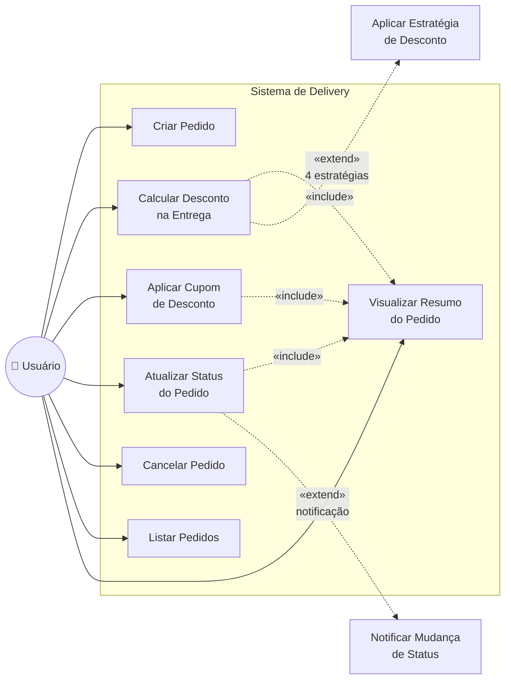
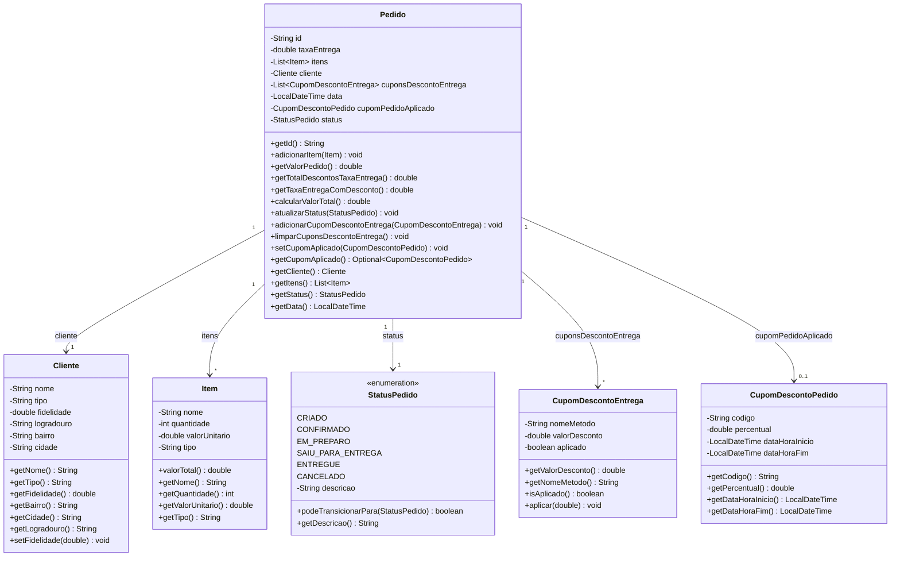
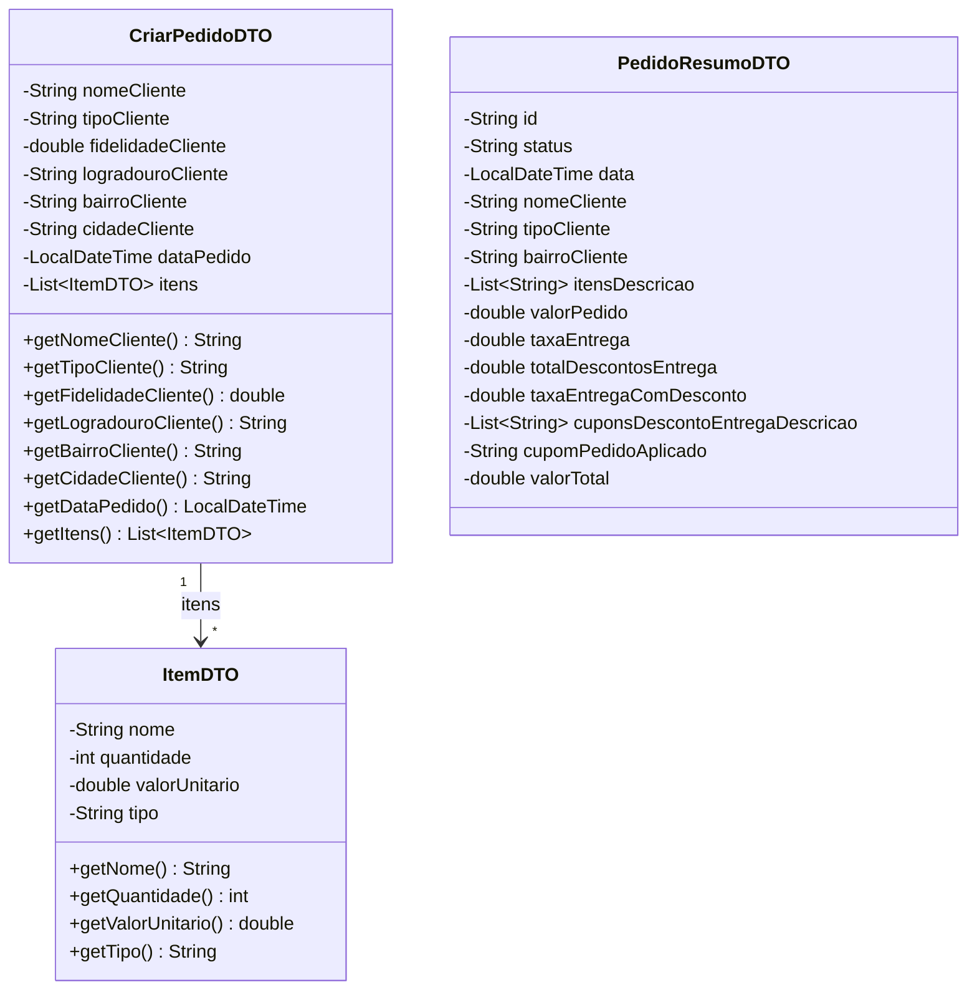
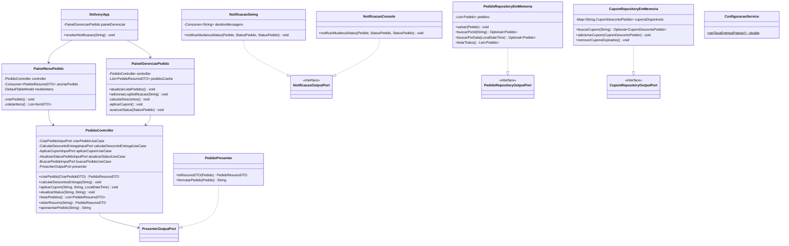

# Diagramas UML — Sistema de Delivery (Clean Architecture)

---

## 1. Diagrama de Caso de Uso

### Descrição dos Casos de Uso

| # | Caso de Uso | Descrição | Use Case correspondente |
|---|------------|-----------|------------------------|
| UC1 | **Criar Pedido** | Usuário informa dados do cliente e itens; sistema cria o pedido com status CRIADO | `CriarPedidoUseCase` |
| UC2 | **Calcular Desconto na Entrega** | Aplica automaticamente as 4 estratégias de desconto na taxa de entrega (Strategy) | `CalcularDescontoEntregaUseCase` |
| UC3 | **Aplicar Cupom de Desconto** | Usuário informa código do cupom; sistema valida existência, validade e aplica percentual | `AplicarCupomUseCase` |
| UC4 | **Atualizar Status do Pedido** | Avança o pedido no ciclo: CRIADO → CONFIRMADO → EM_PREPARO → SAIU_PARA_ENTREGA → ENTREGUE | `AtualizarStatusPedidoUseCase` |
| UC5 | **Cancelar Pedido** | Cancela o pedido (permitido a partir de CRIADO, CONFIRMADO ou EM_PREPARO) | `AtualizarStatusPedidoUseCase` |
| UC6 | **Listar Pedidos** | Lista todos os pedidos cadastrados no repositório | `BuscarPedidoUseCase` |
| UC7 | **Visualizar Resumo** | Exibe resumo formatado com valores, descontos e status | `PedidoPresenter` |

---

## 2. Diagrama de Classes

### 2.1 Camada Domain (Entities)

### 2.2 Camada Application (Use Cases, Ports, DTOs, Strategy)

```mermaid
classDiagram
    class CriarPedidoInputPort {
        <<interface>>
        +executar(CriarPedidoDTO) Pedido
    }

    class CalcularDescontoEntregaInputPort {
        <<interface>>
        +executar(Pedido) void
    }

    class AplicarCupomInputPort {
        <<interface>>
        +executar(Pedido, String, LocalDateTime) void
    }

    class AtualizarStatusPedidoInputPort {
        <<interface>>
        +executar(Pedido, StatusPedido) void
    }

    class BuscarPedidoInputPort {
        <<interface>>
        +buscarPorId(String) Pedido
        +listarTodos() List~Pedido~
    }

    class PedidoRepositoryOutputPort {
        <<interface>>
        +salvar(Pedido) void
        +buscarPorId(String) Optional~Pedido~
        +buscarPorData(LocalDateTime) Optional~Pedido~
        +listarTodos() List~Pedido~
    }

    class CupomRepositoryOutputPort {
        <<interface>>
        +buscarCupom(String) Optional~CupomDescontoPedido~
        +adicionarCupom(CupomDescontoPedido) void
    }

    class NotificacaoOutputPort {
        <<interface>>
        +notificarMudancaStatus(Pedido, StatusPedido, StatusPedido) void
    }

    class PresenterOutputPort {
        <<interface>>
        +toResumoDTO(Pedido) PedidoResumoDTO
        +formatarPedido(Pedido) String
    }

    class IFormaDescontoTaxaEntrega {
        <<interface>>
        +calcularDesconto(Pedido) CupomDescontoEntrega
        +seAplica(Pedido) boolean
    }

    class CriarPedidoUseCase {
        -PedidoRepositoryOutputPort pedidoRepository
        -double taxaEntregaPadrao
        +executar(CriarPedidoDTO) Pedido
    }

    class CalcularDescontoEntregaUseCase {
        -List~IFormaDescontoTaxaEntrega~ metodosDeDesconto
        +executar(Pedido) void
    }

    class AplicarCupomUseCase {
        -CupomRepositoryOutputPort cupomRepository
        +executar(Pedido, String, LocalDateTime) void
    }

    class AtualizarStatusPedidoUseCase {
        -NotificacaoOutputPort notificacao
        +executar(Pedido, StatusPedido) void
    }

    class BuscarPedidoUseCase {
        -PedidoRepositoryOutputPort pedidoRepository
        +buscarPorId(String) Pedido
        +listarTodos() List~Pedido~
    }

    class FormaDescontoTaxaPorBairro {
        -Map~String,Double~ descontoBairro
        +calcularDesconto(Pedido) CupomDescontoEntrega
        +seAplica(Pedido) boolean
    }

    class FormaDescontoTaxaPorTipoCliente {
        -Map~String,Double~ descontosPorTipoCliente
        +calcularDesconto(Pedido) CupomDescontoEntrega
        +seAplica(Pedido) boolean
    }

    class FormaDescontoTipoItem {
        -Map~String,Double~ descontosPorTipoItem
        +calcularDesconto(Pedido) CupomDescontoEntrega
        +seAplica(Pedido) boolean
    }

    class FormaDescontoValorPedido {
        +calcularDesconto(Pedido) CupomDescontoEntrega
        +seAplica(Pedido) boolean
    }

    CriarPedidoUseCase ..|> CriarPedidoInputPort
    CalcularDescontoEntregaUseCase ..|> CalcularDescontoEntregaInputPort
    AplicarCupomUseCase ..|> AplicarCupomInputPort
    AtualizarStatusPedidoUseCase ..|> AtualizarStatusPedidoInputPort
    BuscarPedidoUseCase ..|> BuscarPedidoInputPort

    CriarPedidoUseCase --> PedidoRepositoryOutputPort
    AplicarCupomUseCase --> CupomRepositoryOutputPort
    AtualizarStatusPedidoUseCase --> NotificacaoOutputPort
    BuscarPedidoUseCase --> PedidoRepositoryOutputPort
    CalcularDescontoEntregaUseCase --> IFormaDescontoTaxaEntrega

    FormaDescontoTaxaPorBairro ..|> IFormaDescontoTaxaEntrega
    FormaDescontoTaxaPorTipoCliente ..|> IFormaDescontoTaxaEntrega
    FormaDescontoTipoItem ..|> IFormaDescontoTaxaEntrega
    FormaDescontoValorPedido ..|> IFormaDescontoTaxaEntrega
```

### 2.3 Camada Application — DTOs

### 2.4 Camadas Adapter e Infrastructure

---

## 3. Visão Geral das Camadas

```mermaid
graph TB
    subgraph "🟦 Domain — Entidades puras de negócio"
        Pedido
        Cliente
        Item
        StatusPedido
        CupomDescontoEntrega
        CupomDescontoPedido
    end

    subgraph "🟩 Application — Use Cases, Ports, DTOs, Strategy"
        direction TB
        subgraph "Input Ports"
            CriarPedidoIP["CriarPedidoInputPort"]
            CalcDescontoIP["CalcularDescontoEntregaInputPort"]
            AplicarCupomIP["AplicarCupomInputPort"]
            AtualizarStatusIP["AtualizarStatusPedidoInputPort"]
            BuscarPedidoIP["BuscarPedidoInputPort"]
        end
        subgraph "Use Cases"
            CriarPedidoUC["CriarPedidoUseCase"]
            CalcDescontoUC["CalcularDescontoEntregaUseCase"]
            AplicarCupomUC["AplicarCupomUseCase"]
            AtualizarStatusUC["AtualizarStatusPedidoUseCase"]
            BuscarPedidoUC["BuscarPedidoUseCase"]
        end
        subgraph "Output Ports"
            PedidoRepoOP["PedidoRepositoryOutputPort"]
            CupomRepoOP["CupomRepositoryOutputPort"]
            NotificacaoOP["NotificacaoOutputPort"]
            PresenterOP["PresenterOutputPort"]
        end
        subgraph "Strategy"
            IForma["IFormaDescontoTaxaEntrega"]
            PorBairro["FormaDescontoTaxaPorBairro"]
            PorTipo["FormaDescontoTaxaPorTipoCliente"]
            PorItem["FormaDescontoTipoItem"]
            PorValor["FormaDescontoValorPedido"]
        end
    end

    subgraph "🟨 Adapter — Controller, Presenter, UI"
        PedidoCtrl["PedidoController"]
        Presenter["PedidoPresenter"]
        App["DeliveryApp"]
        PainelNovo["PainelNovoPedido"]
        PainelGerenciar["PainelGerenciarPedido"]
        NotifSwing["NotificacaoSwing"]
    end

    subgraph "🟥 Infrastructure — Repositórios, Notificação, Config"
        PedidoRepoMem["PedidoRepositoryEmMemoria"]
        CupomRepoMem["CupomRepositoryEmMemoria"]
        NotifConsole["NotificacaoConsole"]
        Config["ConfiguracaoService"]
    end

    PedidoRepoMem -.-> PedidoRepoOP
    CupomRepoMem -.-> CupomRepoOP
    NotifConsole -.-> NotificacaoOP
    NotifSwing -.-> NotificacaoOP
    Presenter -.-> PresenterOP

    PedidoCtrl --> CriarPedidoIP
    PedidoCtrl --> CalcDescontoIP
    PedidoCtrl --> AplicarCupomIP
    PedidoCtrl --> AtualizarStatusIP
    PedidoCtrl --> BuscarPedidoIP
    PedidoCtrl --> PresenterOP

    CriarPedidoUC -.-> CriarPedidoIP
    CalcDescontoUC -.-> CalcDescontoIP
    AplicarCupomUC -.-> AplicarCupomIP
    AtualizarStatusUC -.-> AtualizarStatusIP
    BuscarPedidoUC -.-> BuscarPedidoIP

    PorBairro -.-> IForma
    PorTipo -.-> IForma
    PorItem -.-> IForma
    PorValor -.-> IForma
```

